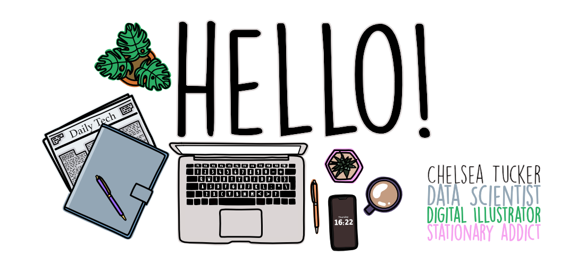
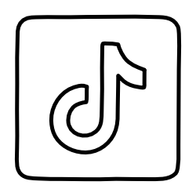
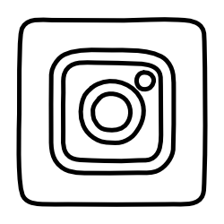
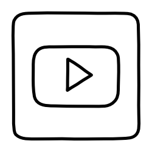

Hey, I'm Chelsea. A lover of geeky things, I spend my day as a Data Scientist building machine and deep leasrning models. By evening I champion and promote women and non-binary people in STEM subjects through speaking at events and creating content on socials. 

This repository contains some of the learning resources that I freely provide. These will be materials that I have showcased on one of my social media platforms. Check out the links below and come say hi!

**Connect with me:**

